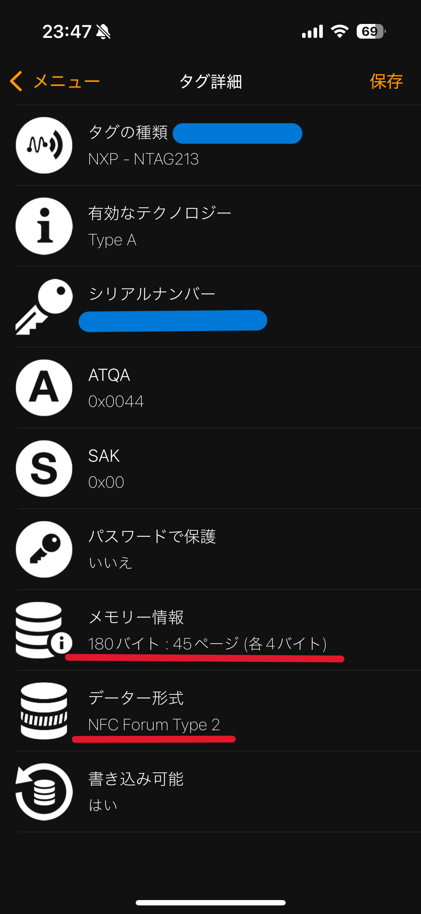

# HRYoobaUnity.NFC
## 1.インストール
ProjectSetting/PackageManagerから以下のScopeRegistriesを設定
- Name: `package.openupm.com`
- URL: `https://package.openupm.com`
- Scope(s):
  - `com.hryooba`
  - `com.cysharp`
  - `org.nuget`

## 2.外部ライブラリ
このプロジェクトは[PCSC](https://github.com/danm-de/pcsc-sharp), [Simple Ndef Parser](https://office-fun.com/https-office-fun-com-techmemo-csharp-nfcreading-practice06-ndefclasslib/)を使用しており、該当部分にはオリジナルのライセンスが適用されています。  
詳細については
- [COPYING.txt](https://github.com/HRYooba/HRYoobaUnity.NFC/blob/main/Runtime/Plugins/PCSC.7.0.0/COPYING.txt)
- [COPYING.txt](https://github.com/HRYooba/HRYoobaUnity.NFC/blob/main/Runtime/Plugins/PCSC.Iso7816.7.0.0/COPYING.txt)
- [License.txt](https://github.com/HRYooba/HRYoobaUnity.NFC/blob/main/Runtime/NdefParser/License.txt)  

ファイルを参照してください。

## 3.使い方
### 3.1.サンプル
```csharp
using UnityEngine;
using Cysharp.Threading.Tasks;
using R3;
using HRYooba.NFC;

public class NfcTest : MonoBehaviour
{
    private NfcReader _nfcReader = new();

    private void Start()
    {
        _nfcReader.Initialize();

        _nfcReader.OnCardDetectedObservable
            .Subscribe(_ => Debug.Log("Card detected"))
            .AddTo(this);

        _nfcReader.OnCardRemovedObservable
            .Subscribe(_ => Debug.Log("Card removed"))
            .AddTo(this);

        UniTask.Create(async () =>
        {
            var idm = await _nfcReader.ReadIDmAsync(destroyCancellationToken);
            Debug.Log(idm);

            var url = await _nfcReader.ReadURIFromType2TagAsync(4, 45, destroyCancellationToken);
            Debug.Log(url);

            var technologyType = await _nfcReader.ReadTechnologyTypeAsync(destroyCancellationToken);
            Debug.Log(technologyType);
        }).Forget();
    }

    private void OnDestroy()
    {
        _nfcReader.Dispose();
    }
}
```
### 3.2.ReadIDmAsync
シリアルナンバー(IDm(UID))を読み取ります

### 3.3.ReadURIFromType2TagAsync
Type2タグからURIを読み取ります
```csharp
var url = await _nfcReader.ReadURIFromType2TagAsync(pageByte, pageCount, ct);
```

- pageByte: 各ページのバイト数
- pageCount: 読み取るページ数

NFC Toolなどで確認してください  


### 3.4.ReadTechnologyTypeAsync
カードのテクノロジータイプを読み取ります
- TypeA ISO/IEC 14443A
- TypeB ISO/IEC 14443B
- TypeF JIS X 6319-4, FeliCa

